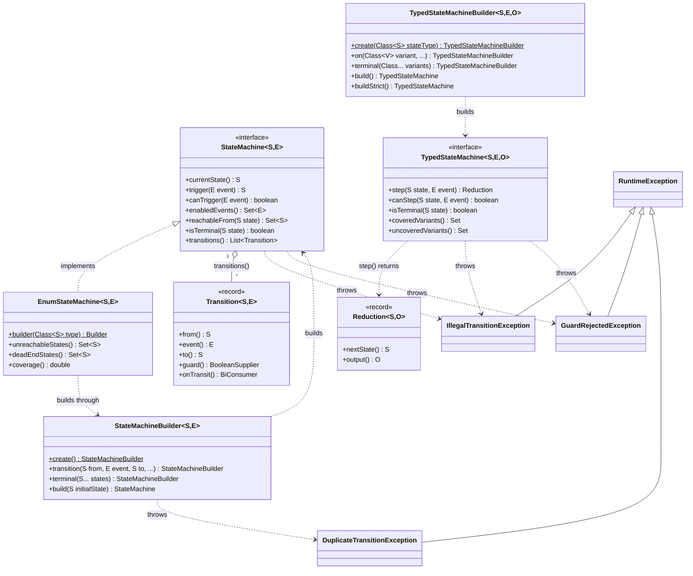
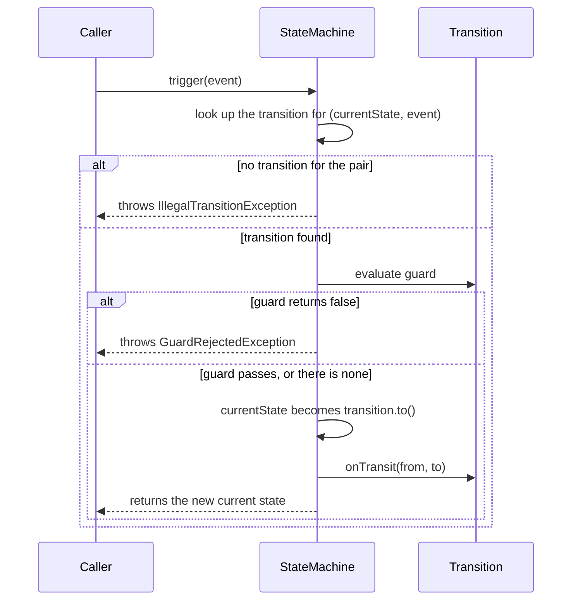

# State Machines

Small, dependency-free finite state machines for Java.

The library has two machines, and both throw the same `IllegalTransitionException` and `GuardRejectedException`:

- **Value/enum machine** (`StateMachine`, `StateMachineBuilder`, `EnumStateMachine`, `Transition`). States are plain values matched by equality, transitions move to a constant target, and the machine holds a mutable current state. It supports guards and post-transition callbacks. The enum variant adds topology diagnostics: unreachable states, dead ends and coverage.
- **Typed machine** (`TypedStateMachine`, `TypedStateMachineBuilder`, `Reduction`). States are a `sealed` hierarchy of payload-carrying records. Each event is routed by the state's runtime variant to a reducer that computes the next state together with an output. The machine is immutable and thread-safe, and it can check at build time that every permitted variant is either handled or declared terminal.

The library depends only on the JDK.

Scope: deterministic state machines (value/enum), and Mealy-style typed machines whose record states carry data (EFSM). Hierarchical states, orthogonal regions and non-deterministic transitions are out of scope for 0.x.

## Finite state machines in brief

> We may compare a man in the process of computing a real number to a machine which is only capable of a finite number of conditions q<sub>1</sub>, q<sub>2</sub>, ..., q<sub>R</sub> which will be called "m-configurations".
>
> — A. M. Turing, [*On Computable Numbers, with an Application to the Entscheidungsproblem*](https://doi.org/10.1112/plms/s2-42.1.230), 1936

A finite state machine describes something that is always in exactly one of a fixed set of situations and moves between them only in defined ways. The vocabulary used throughout this library:

- **State**: the situation the machine is in, for example `PAID` for an order.
- **Event**: something that happens and may cause a move, for example `SHIP`.
- **Transition**: a move from one state to another on an event. Here, each `(state, event)` pair has at most one transition.
- **Guard**: a condition checked when the event arrives. If it fails, the transition does not happen.
- **Action or callback**: code that runs when a transition is taken, such as logging or emitting an output.
- **Terminal state**: a state the machine is meant to end in, such as `DELIVERED` or `CANCELLED`.

A state machine fits well when an object has a clear lifecycle and illegal moves should be impossible rather than merely unlikely: lifecycles of domain objects (orders, tickets, payments), workflows with review and approval steps, protocol handshakes, and UI flows such as wizards or login sequences. It does not fit when a plain `if` or `switch` expresses the logic just as clearly, or when the process is a durable, long-running orchestration that must survive restarts, retries and timeouts across services. A workflow engine fits that case better.

Where the library sits among the classic kinds of state machine:

| Kind | Supported? |
|---|---|
| DFA | yes (value/enum machine) |
| Mealy | yes (typed machine via `Reduction` output) |
| Moore | derivable from state |
| EFSM | yes (typed machine, record states carry data; guards see state and event) |
| NFA | no |
| Hierarchical | no |
| Orthogonal regions | no |

A Moore machine's output depends on the state alone, so it can be computed from `currentState()` or from the typed machine's next state without any extra support.

## Installation

Maven:

```xml
<dependency>
  <groupId>io.github.mova77</groupId>
  <artifactId>state-machines</artifactId>
  <version>0.1.0</version>
</dependency>
```

Gradle:

```kotlin
implementation("io.github.mova77:state-machines:0.1.0")
```

The jar declares the automatic module name `io.github.mova77.statemachines`.

## Minimum Java version

**Java 21.** The library is compiled with `--release 21`. Java 21 is an LTS, and choosing it as the floor means the library can use pattern matching for `switch` and record patterns without raising the minimum version later. CI builds and tests on Java 21 and Java 25, and the build itself refuses to run on an older JDK.

## Design

> Much of computer science is about state machines. This is as obvious a remark as saying that much of physics is about equations.
>
> — Leslie Lamport, [*Computation and State Machines*](https://lamport.azurewebsites.net/pubs/state-machine.pdf), 2008

### Principles

> Digital computers are themselves more complex than most things people build; they have very large numbers of states. This makes conceiving, describing, and testing them hard.
>
> — Frederick P. Brooks Jr., [*No Silver Bullet: Essence and Accidents of Software Engineering*](https://www.cs.unc.edu/techreports/86-020.pdf), 1986

- **Zero runtime dependencies.** The library uses only the JDK. The build rejects any dependency outside test scope.
- **Immutable definitions.** A built machine copies its transitions, terminal states and handlers into unmodifiable collections. Builders are mutable, but a machine never changes its definition after `build`.
- **Deterministic by construction.** The value machine has at most one transition per `(state, event)` pair, and the typed machine has at most one handler per state variant. Duplicates are rejected while building, never resolved silently.
- **Fail fast with domain exceptions.** Illegal moves throw exceptions that carry their context (the state, the event and, where it applies, the target or the available events), rather than returning a status code.
- **No framework, minimal reflection.** There are no annotations, no proxies, no code generation and no runtime scanning. The typed machine routes by the state's class, using `getClass()` and `Class.asSubclass()`, and calls `Class.isSealed()` and `Class.getPermittedSubclasses()` only for the completeness check. Nothing else is reflective.

### Core abstractions



The diagram shows the public API only. `StateMachineBuilder.build` returns a package-private implementation of `StateMachine`, and `EnumStateMachine` wraps such a machine and delegates to it. `TypedStateMachineBuilder.build` likewise returns a package-private implementation of `TypedStateMachine`. Neither implementation is part of the API.

### The two models compared

| | Value/enum machine | Typed machine |
|---|---|---|
| Current state | held by the machine and changed by `trigger` | held by the caller; `step` is a function of `(state, event)` |
| Thread-safety | not thread-safe | immutable and thread-safe |
| Next state | a constant target fixed when the transition is registered | computed by a reducer, together with an output |
| Routing | by `equals`/`hashCode` of the state and the event | by the runtime class of the state |
| Guards | `BooleanSupplier`, which sees neither state nor event | `BiPredicate`, which sees the state and the event |
| Output | none; side effects go in the `onTransit` callback | the `output` of the returned `Reduction` |

### Lifecycle of a trigger



The state changes before the callback runs. A callback must not throw: if it does, the exception propagates out of `trigger`, and the machine is already in the new state. `canTrigger` and `enabledEvents` run the same lookup and guard but change nothing.

A typed `step(state, event)` follows the same order without storing anything. It finds the handler registered for the state's runtime class and throws `IllegalTransitionException` if there is none, which includes variants declared terminal. If the handler has a guard that rejects `(state, event)`, it throws `GuardRejectedException`. Otherwise it calls the reducer and returns the `Reduction`.

### Error model

| Exception | Thrown by | When |
|---|---|---|
| `IllegalTransitionException` | `trigger`, `step` | No transition is defined for the current state and event. For `step`, no handler is registered for the state's variant, including terminal variants. Carries the state, the event and, for `trigger`, the events that do have a transition from that state. |
| `GuardRejectedException` | `trigger`, `step` | The transition or handler exists, but its guard returns `false`. Carries the state, the event and, for `trigger`, the target state. |
| `DuplicateTransitionException` | `StateMachineBuilder.build`, `EnumStateMachine.Builder.buildEnum` | Two transitions were registered for the same `(state, event)` pair. Carries the state and the event. |
| `IllegalArgumentException` | `StateMachineBuilder.build`, `buildEnum`, `TypedStateMachineBuilder.build` | No transition or handler was registered. Also thrown by the `Reduction` constructor when `nextState` is `null`. |
| `IllegalStateException` | `TypedStateMachineBuilder.on`, `terminal`, `buildStrict` | A variant got a second handler, or was declared both handled and terminal; or `buildStrict` found a permitted variant that is neither handled nor terminal. |
| `NullPointerException` | `TypedStateMachineBuilder`, `TypedStateMachine` | A `null` state type, variant, reducer or guard was registered, or a `null` state was passed to `step`, `canStep` or `isTerminal`. |
| `NullPointerException` | `StateMachineBuilder`, `EnumStateMachine`, `StateMachine` | The value machine does not validate `null` up front, so use non-null states and events. With `null` it can fail later with a `NullPointerException`, for example: a `null` terminal state at `build`; a `null` enum class at `buildEnum`; `isTerminal(null)`, or `isTerminal()` and `unreachableStates()` while the current state is `null`; and `trigger` on an undefined event when a transition was registered with a `null` event, because building the `IllegalTransitionException`'s set of available events fails. |

### Thread-safety and determinism

> A computer is a state machine. Threads are for people who cant [sic] program state machines.
>
> — Alan Cox, [message to the linux-kernel mailing list](https://lkml.iu.edu/hypermail/linux/kernel/0001.2/1335.html), 21 January 2000

- A value/enum machine is **not thread-safe**. `trigger` reads and writes the current state without synchronisation, so confine an instance to one thread or synchronise access externally. Its definition (transitions and terminal states) never changes after `build`.
- A typed machine is **immutable and safe to share between threads**. It holds no current state. A `step` call is exactly as thread-safe as the guard and reducer it runs, so these should be pure functions of their arguments.
- Builders are **not thread-safe and not reusable**. Call a build method once per builder.
- **Determinism:** for a given current state and event, the value machine has at most one candidate transition, so the outcome depends only on the result of its guard. The typed machine has at most one handler per variant, so the outcome is whatever that handler's guard and reducer compute. Guards, callbacks and reducers are your code, so the machine is only as deterministic as they are.
- **Ordering:** `transitions()` keeps registration order, and the enum diagnostics return `EnumSet`s in declaration order. `enabledEvents()`, `reachableFrom()` and `coveredVariants()` are sets with no defined iteration order.

### Extension points

The current extension points are the functions you register:

- **Guards**: a `BooleanSupplier` on a value transition, or a `BiPredicate<state, event>` on a typed handler.
- **Callbacks**: a `BiConsumer<from, to>` (`onTransit`) on a value transition, run after the state has changed.
- **Reducers**: a `BiFunction<state, event, Reduction>` per typed variant, which computes the next state and the output.

Value-machine states and events can be any types with correct `equals` and `hashCode`. Typed-machine states are routed by class, and need a `sealed` state type for the completeness check. Planned extension points, such as entry and exit actions, are listed in the [roadmap](#roadmap).

## Examples

Every example below is compiled and run by the test suite (`ReadmeExamplesTest`), which also checks that the code here matches the code it runs. Imports are omitted.

### Turnstile: the minimal DFA

A coin-operated turnstile is the classic first state machine. A coin unlocks it, a push locks it again, and nothing else changes it.

```java
enum Turnstile { LOCKED, UNLOCKED }
enum Input { COIN, PUSH }
```

```java
EnumStateMachine<Turnstile, Input> turnstile =
        EnumStateMachine.<Turnstile, Input>builder(Turnstile.class)
                .transition(Turnstile.LOCKED,   Input.COIN, Turnstile.UNLOCKED)
                .transition(Turnstile.LOCKED,   Input.PUSH, Turnstile.LOCKED)
                .transition(Turnstile.UNLOCKED, Input.COIN, Turnstile.UNLOCKED)
                .transition(Turnstile.UNLOCKED, Input.PUSH, Turnstile.LOCKED)
                .buildEnum(Turnstile.LOCKED);

turnstile.trigger(Input.COIN);   // UNLOCKED
turnstile.trigger(Input.PUSH);   // LOCKED
turnstile.coverage();            // 1.0: every state takes part in a transition
```

### Value/enum machine: an order lifecycle

```java
enum Order { PLACED, PAID, SHIPPED, DELIVERED, CANCELLED }
enum Event { PAY, SHIP, DELIVER, CANCEL }
```

```java
AtomicBoolean paymentVerified = new AtomicBoolean(true);

EnumStateMachine<Order, Event> order = EnumStateMachine.<Order, Event>builder(Order.class)
        .transition(Order.PLACED,  Event.PAY,     Order.PAID, paymentVerified::get)
        .transition(Order.PLACED,  Event.CANCEL,  Order.CANCELLED)
        .transition(Order.PAID,    Event.SHIP,    Order.SHIPPED)
        .transition(Order.SHIPPED, Event.DELIVER, Order.DELIVERED)
        .terminal(Order.DELIVERED, Order.CANCELLED)
        .buildEnum(Order.PLACED);

boolean canPay = order.canTrigger(Event.PAY);   // true: the transition exists and its guard passes
order.trigger(Event.PAY);          // PAID (GuardRejectedException if the guard failed)
try {
    order.trigger(Event.DELIVER);  // there is no DELIVER transition from PAID
} catch (IllegalTransitionException e) {
    e.availableEvents();           // [SHIP]
}
order.deadEndStates();             // []: every non-terminal state has a way out
```

Each `(state, event)` pair may have at most one transition: registering a second one makes `build`/`buildEnum` throw `DuplicateTransitionException` instead of silently replacing the first.

For states that are not enums, use `StateMachineBuilder.<S, E>create()` in the same way and finish with `build(initialState)`. This machine is not thread-safe.

### Guards and callbacks: a kanban work item

A work item moves across a board. Starting work is guarded by a work-in-progress limit read from a shared counter, and every move is logged by the `onTransit` callback, which receives the source and target states.

```java
enum Column { TODO, IN_PROGRESS, IN_REVIEW, DONE }
enum Move { START, SUBMIT, APPROVE, REJECT }
```

```java
int wipLimit = 2;
AtomicInteger inProgress = new AtomicInteger(2);   // items already in progress on the board
List<String> log = new ArrayList<>();
BiConsumer<Column, Column> logMove = (from, to) -> log.add(from + " -> " + to);

StateMachine<Column, Move> item = StateMachineBuilder.<Column, Move>create()
        .transition(Column.TODO,        Move.START,   Column.IN_PROGRESS,
                () -> inProgress.get() < wipLimit, logMove)
        .transition(Column.IN_PROGRESS, Move.SUBMIT,  Column.IN_REVIEW,   () -> true, logMove)
        .transition(Column.IN_REVIEW,   Move.REJECT,  Column.IN_PROGRESS, () -> true, logMove)
        .transition(Column.IN_REVIEW,   Move.APPROVE, Column.DONE,        () -> true, logMove)
        .terminal(Column.DONE)
        .build(Column.TODO);

boolean canStart = item.canTrigger(Move.START);   // false: the WIP limit is reached
inProgress.decrementAndGet();  // another item leaves the column
item.trigger(Move.START);      // IN_PROGRESS
item.trigger(Move.SUBMIT);     // IN_REVIEW
item.trigger(Move.APPROVE);    // DONE
item.isTerminal();             // true
// log: [TODO -> IN_PROGRESS, IN_PROGRESS -> IN_REVIEW, IN_REVIEW -> DONE]
```

### Typed machine: a login flow

```java
sealed interface Login permits Identify, VerifyPassword, Authenticated, Denied {}
record Identify() implements Login {}
record VerifyPassword(String user, int attempts) implements Login {}
record Authenticated(String user) implements Login {}
record Denied(String reason) implements Login {}

enum LoginEvent { SUBMIT, GOOD_PASSWORD, BAD_PASSWORD }
```

```java
TypedStateMachine<Login, LoginEvent, String> login =
        TypedStateMachineBuilder.<Login, LoginEvent, String>create(Login.class)
                .on(Identify.class, (s, e) -> Reduction.to(new VerifyPassword("alice", 0)))
                .on(VerifyPassword.class,
                        (VerifyPassword s, LoginEvent e) -> s.attempts() < 3,   // guard
                        (VerifyPassword s, LoginEvent e) -> e == LoginEvent.GOOD_PASSWORD
                                ? Reduction.of(new Authenticated(s.user()), "welcome")
                                : Reduction.of(new VerifyPassword(s.user(), s.attempts() + 1), "retry"))
                .terminal(Authenticated.class, Denied.class)
                .buildStrict();   // fails if any permitted variant is neither handled nor terminal

Reduction<Login, String> r = login.step(new VerifyPassword("alice", 0), LoginEvent.GOOD_PASSWORD);
r.nextState();   // Authenticated[user=alice]
r.output();      // "welcome"
```

The caller owns the state value. `step` is a pure function of `(state, event)`.

### Typed machine as a Mealy machine: a vending machine

The state carries data (the credit inserted so far), the events carry data (coin values, the selected item and its price), and every step can emit an output (the dispensed item and change). This is a Mealy machine with an extended state, and the reducers use `switch` pattern matching over the sealed event type.

```java
sealed interface Vending permits Idle, HasCredit {}
record Idle() implements Vending {}
record HasCredit(int cents) implements Vending {}

sealed interface Action permits Coin, Select, Refund {}
record Coin(int cents) implements Action {}
record Select(String item, int price) implements Action {}
record Refund() implements Action {}

sealed interface Output permits Vend, Change {}
record Vend(String item, int change) implements Output {}
record Change(int cents) implements Output {}
```

```java
TypedStateMachine<Vending, Action, Output> vending =
        TypedStateMachineBuilder.<Vending, Action, Output>create(Vending.class)
                .on(Idle.class, (s, e) -> switch (e) {
                    case Coin coin -> Reduction.to(new HasCredit(coin.cents()));
                    case Select select -> Reduction.to(s);   // no credit, nothing happens
                    case Refund refund -> Reduction.to(s);
                })
                .on(HasCredit.class, (s, e) -> switch (e) {
                    case Coin coin -> Reduction.to(new HasCredit(s.cents() + coin.cents()));
                    case Select select when select.price() <= s.cents() -> Reduction.of(
                            new Idle(), new Vend(select.item(), s.cents() - select.price()));
                    case Select select -> Reduction.to(s);   // not enough credit yet
                    case Refund refund -> Reduction.of(new Idle(), new Change(s.cents()));
                })
                .buildStrict();

Vending state = new Idle();
state = vending.step(state, new Coin(100)).nextState();   // HasCredit[cents=100]
state = vending.step(state, new Coin(50)).nextState();    // HasCredit[cents=150]
Reduction<Vending, Output> sale = vending.step(state, new Select("water", 120));
sale.nextState();   // Idle[]
sale.output();      // Vend[item=water, change=30]
```

### Diagnostics

The enum machine inspects its own topology. This uses the `Order` and `Event` enums from the order example, with a deliberately incomplete set of transitions.

```java
EnumStateMachine<Order, Event> draft = EnumStateMachine.<Order, Event>builder(Order.class)
        .transition(Order.PLACED, Event.PAY,  Order.PAID)
        .transition(Order.PAID,   Event.SHIP, Order.SHIPPED)
        .terminal(Order.DELIVERED)
        .buildEnum(Order.PLACED);

draft.unreachableStates();   // [DELIVERED, CANCELLED]: no transition leads to them
draft.deadEndStates();       // [SHIPPED, CANCELLED]: not terminal, and no way out
draft.coverage();            // 0.6: three of the five states take part in a transition
```

The typed machine checks completeness over the sealed state type. This uses the vending types from the previous example, with only one variant handled.

```java
TypedStateMachine<Vending, Action, Output> partial =
        TypedStateMachineBuilder.<Vending, Action, Output>create(Vending.class)
                .on(Idle.class, (s, e) -> Reduction.to(s))
                .build();

partial.uncoveredVariants();   // [class HasCredit]: neither handled nor declared terminal
```

Building the same registrations with `buildStrict()` instead of `build()` throws `IllegalStateException` naming `HasCredit`, which turns a forgotten variant into a build-time failure.

## Roadmap

> To be useful, a state/event approach must be modular, hierarchical and well-structured. It must also solve the exponential blow-up problem by somehow relaxing the requirement that all combinations of states have to be represented explicitly.
>
> — David Harel, [*Statecharts: A Visual Formalism for Complex Systems*](https://doi.org/10.1016/0167-6423(87)90035-9), 1987

The roadmap states intent, not commitment. Under the 0.x compatibility promise below, any of it may change.

- **0.1.0**: this release.
- **Next minor release**:
  - guarded choice: several guarded transitions for one event, where the first match wins;
  - entry and exit actions;
  - the event passed to the transition callback;
  - clarified `unreachableStates()` semantics.
- **Planned**: a sibling module, `state-machines-definition`, that loads machines from versioned JSON or YAML documents validated against a published JSON Schema.
- **Considered only on demonstrated need**: hierarchical states and orthogonal regions.
- **Not planned**: non-deterministic transitions.

## Compatibility

The project follows [Semantic Versioning](https://semver.org/). While the version is `0.x`, minor releases may contain breaking changes. That stays true until at least two independent downstream projects depend on the library. After that, a `1.0.0` release will freeze the public API, and breaking changes will then come only with a new major version. Package-private types are not part of the API.

## Building

```sh
mvn clean verify
```

The build needs JDK 21 or newer and Maven 3.9 or newer. It compiles with `-Xlint:all -Werror`, runs the tests, and builds the sources and javadoc jars with doclint enabled. Builds are reproducible for a given JDK: the same sources built on the same JDK give byte-identical jars. Releases are built on JDK 25.

## Further reading

- A. M. Turing, "On Computable Numbers, with an Application to the Entscheidungsproblem", *Proceedings of the London Mathematical Society* s2-42(1), 230–265, 1936–37. [doi:10.1112/plms/s2-42.1.230](https://doi.org/10.1112/plms/s2-42.1.230)
- G. H. Mealy, "A Method for Synthesizing Sequential Circuits", *Bell System Technical Journal* 34(5), 1045–1079, 1955. [doi:10.1002/j.1538-7305.1955.tb03788.x](https://doi.org/10.1002/j.1538-7305.1955.tb03788.x)
- E. F. Moore, "Gedanken-Experiments on Sequential Machines", in *Automata Studies* (Annals of Mathematics Studies 34), Princeton University Press, 1956, pp. 129–154. [doi:10.1515/9781400882618-006](https://doi.org/10.1515/9781400882618-006)
- M. L. Minsky, *Computation: Finite and Infinite Machines*, Prentice-Hall, 1967.
- J. E. Hopcroft and J. D. Ullman, *Introduction to Automata Theory, Languages, and Computation*, Addison-Wesley, 1979; third edition with R. Motwani, Pearson/Addison-Wesley, 2006.
- F. P. Brooks Jr., "No Silver Bullet: Essence and Accidents of Software Engineering", *Proceedings of the IFIP Tenth World Computing Conference*, 1986, pp. 1069–1076 ([UNC technical report TR86-020](https://www.cs.unc.edu/techreports/86-020.pdf)); reprinted in *Computer* 20(4), 10–19, 1987. [doi:10.1109/MC.1987.1663532](https://doi.org/10.1109/MC.1987.1663532)
- D. Harel, "Statecharts: A Visual Formalism for Complex Systems", *Science of Computer Programming* 8(3), 231–274, 1987. [doi:10.1016/0167-6423(87)90035-9](https://doi.org/10.1016/0167-6423(87)90035-9)
- L. Lamport, "Computation and State Machines", 2008. [PDF](https://lamport.azurewebsites.net/pubs/state-machine.pdf)
- A. Cox, "Re: Interesting analysis of linux kernel threading by IBM", linux-kernel mailing list, 21 January 2000. [Archive](https://lkml.iu.edu/hypermail/linux/kernel/0001.2/1335.html)
- A. Cox, "Re: Alan Cox quote? (was: Re: accounting for threads)", linux-kernel mailing list, 19 June 2001. [Archive](https://lkml.iu.edu/hypermail/linux/kernel/0106.2/0444.html)

## Licence

MIT, see [LICENSE](LICENSE) and [NOTICE](NOTICE).
